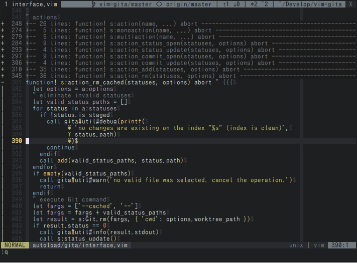
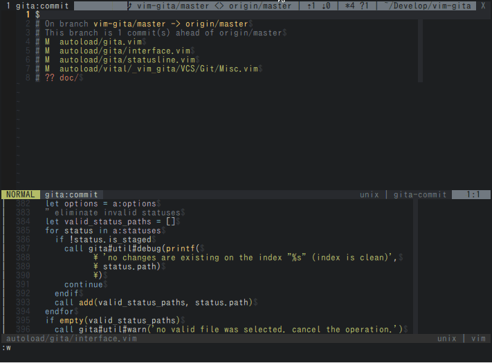
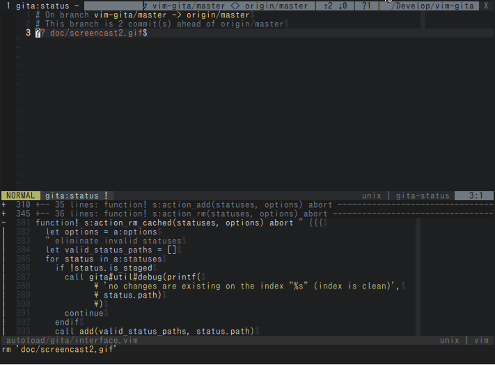
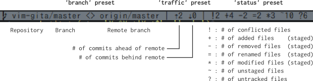

vim-gita [WIP]
===============================================================================


*vim-gita* is a plugin for manipulating Git. It provide the following features

-   `:Gita status` which is for manipulating index (staged) and working tree (unstaged)
-   `:Gita commit` which is for writing a commit message
-   `:Gita diff` which is for comparing a difference (Not implemented yet)
-   `:Gita blame` which is for blaming (Not implemented yet)
-   `:Gita {command}` which is for executing a git command (e.g. `:Gita push` is alternative of `:!git -c color.ui=false push`)

The original concepts and strategies are taken from [tpope/vim-fugitive](https://github.com/tpope/vim-fugitive), [Shougo/vim-vcs](https://github.com/Shougo/vim-vcs), and [lambdalisue/vim-gista](https://github.com/lambdalisue/vim-gista).

How to install
-------------------------------------------------------------------------------
The [repository](https://github.com/lambdalisue/vim-gita) follow a standard directory structure of vim plugin thus you can use [Vundle.vim](https://github.com/gmarik/Vundle.vim) or [neobundle.vim](https://github.com/Shougo/neobundle.vim) to install vim-gita like:

```vim
" Vundle.vim
Plugin 'lambdalisue/vim-gita'

" neobundle.vim
NeoBundle 'lambdalisue/vim-gita'

" neobundle.vim (Lazy)
NeoBundleLazy 'lambdalisue/vim-gita', {
    \ 'autoload': {
    \    'commands': ['Gita'],
    \    'mappings': '<Plug>(gita-',
    \}}
```

If you are not using any vim plugin managers, you can copy the repository to your $VIM directory to enable the plugin but I strongly recommend you to try one of those vim plugin managers.


How to use
-------------------------------------------------------------------------------

All commands start from `:Gita`. The command provides completion thus type `:Gita <TAB>` show all commands vim-gita supports (WIP, not all commands are tested yet).


### Status

`:Gita status` open a new buffer called `gita:status` (or `gita_status` in windows).
The buffer show similar information which you can get from `git status --short`. (See [git-status(1)](https://www.kernel.org/pub/software/scm/git/docs/git-status.html).)



You can add/remove files from/to index and working tree via the following keymaps:

| Map      | Action                                                    |
|----------|-----------------------------------------------------------|
| `q`      | Close the buffer                                          |
| `<CR>`   | Open selected file                                        |
| `<S-CR>` | Not implemented yet                                       |
| `e`      | Open selected file                                        |
| `E`      | Open selected file (vsplit)                               |
| `<C-e>`  | Open selected file (split)                                |
| `d`      | Not implemented yet                                       |
| `D`      | Not implemented yet                                       |
| `<C-d>`  | Not implemented yet                                       |
| `<C-l>`  | Update status                                             |
| `cc`     | Open a commit buffer                                      |
| `cA`     | Open a new commit buffer (--amend)                        |
| `cC`     | Open a new commit buffer                                  |
| `-a`     | Add to index (`git add`)                                  |
| `-A`     | Add to index forcibly (`git add --force`)                 |
| `-r`     | Remove from index (`git rm`)                              |
| `-R`     | Remove from index forcibly (`git rm --force`)             |
| `-h`     | Remove from cache (`git rm --cached)`                     |
| `-c`     | Checkout from HEAD (`git checkout HEAD)`                  |
| `-C`     | Checkout from HEAD forcibly (`git checkout HEAD --force)` |
| `-=`     | Revert (checkout/delete) file                             |
| `--`     | Toggle (add/rm/rm --cached) file                          |

File operating actions are also available in visual mode to execute actions on the multiple files.

### Commit

`:Gita commit` open a new buffer called `gita:commit` (or `gita_commit` in windows).
The buffer show similar information which you can get from `git status --short`. (See [git-status(1)](https://www.kernel.org/pub/software/scm/git/docs/git-status.html).)

You can edit a commit message and the commit will executed when user hit `CC` or close the buffer window.
All modifications are cached when user hit `:w`, thus you can go/back to/from gita-status buffer without loosing draft commit message via `cc`.



Additionally, the following keymaps are available:

| Map      | Action                                                    |
|----------|-----------------------------------------------------------|
| `q`      | Close the buffer                                          |
| `<CR>`   | Open selected file                                        |
| `<S-CR>` | Not implemented yet                                       |
| `e`      | Open selected file                                        |
| `E`      | Open selected file (vsplit)                               |
| `<C-e>`  | Open selected file (split)                                |
| `d`      | Not implemented yet                                       |
| `D`      | Not implemented yet                                       |
| `<C-d>`  | Not implemented yet                                       |
| `<C-l>`  | Update status                                             |
| `cc`     | Open a status buffer                                      |
| `CC`     | Execute commit                                            |


### Statusline/Tabline



vim-gita provide a statusline function. The function simply return a string thus you can use the function in vim's statusline or some statusline plugins like [lightline.vim](https://github.com/itchyny/lightline.vim).
The following is my settings for lightline.vim. It use tabline instead of statusline.

```vim
let g:lightline = {
      \ 'colorscheme': 'hybrid',
      \ 'active': {
      \   'left': [
      \     [ 'mode', 'paste' ],
      \     [ 'filename' ],
      \   ],
      \   'right': [
      \     [ 'lineinfo' ],
      \     [ 'fileformat', 'fileencoding', 'filetype' ],
      \   ],
      \ },
      \ 'inactive': {
      \   'left': [
      \     [ 'filename' ],
      \   ],
      \   'right': [
      \     [ 'fileformat', 'fileencoding', 'filetype' ],
      \   ],
      \ },
      \ 'tabline': {
      \   'left': [
      \     [ 'tabs' ],
      \   ],
      \   'right': [
      \     [ 'close' ],
      \     [ 'git_branch', 'git_traffic', 'git_status', 'cwd' ],
      \   ],
      \ },
      \ 'component_visible_condition': {
      \   'lineinfo': '(winwidth(0) >= 70)',
      \ },
      \ 'component_function': {
      \   'git_branch': 'g:lightline.my.git_branch',
      \   'git_traffic': 'g:lightline.my.git_traffic',
      \   'git_status': 'g:lightline.my.git_status',
      \ },
      \}
let g:lightline.my = {}
function! g:lightline.my.git_branch() " {{{
  return winwidth(0) > 70 ? gita#statusline#preset('branch') : ''
endfunction " }}}
function! g:lightline.my.git_traffic() " {{{
  return winwidth(0) > 70 ? gita#statusline#preset('traffic') : ''
endfunction " }}}
function! g:lightline.my.git_status() " {{{
  return winwidth(0) > 70 ? gita#statusline#preset('status') : ''
endfunction " }}}
```

License
-------------------------------------------------------------------------------
The MIT License (MIT)

Copyright (c) 2015 Alisue, hashnote.net

Permission is hereby granted, free of charge, to any person obtaining a copy
of this software and associated documentation files (the "Software"), to deal
in the Software without restriction, including without limitation the rights
to use, copy, modify, merge, publish, distribute, sublicense, and/or sell
copies of the Software, and to permit persons to whom the Software is
furnished to do so, subject to the following conditions:

The above copyright notice and this permission notice shall be included in
all copies or substantial portions of the Software.

THE SOFTWARE IS PROVIDED "AS IS", WITHOUT WARRANTY OF ANY KIND, EXPRESS OR
IMPLIED, INCLUDING BUT NOT LIMITED TO THE WARRANTIES OF MERCHANTABILITY,
FITNESS FOR A PARTICULAR PURPOSE AND NONINFRINGEMENT. IN NO EVENT SHALL THE
AUTHORS OR COPYRIGHT HOLDERS BE LIABLE FOR ANY CLAIM, DAMAGES OR OTHER
LIABILITY, WHETHER IN AN ACTION OF CONTRACT, TORT OR OTHERWISE, ARISING FROM,
OUT OF OR IN CONNECTION WITH THE SOFTWARE OR THE USE OR OTHER DEALINGS IN
THE SOFTWARE.
