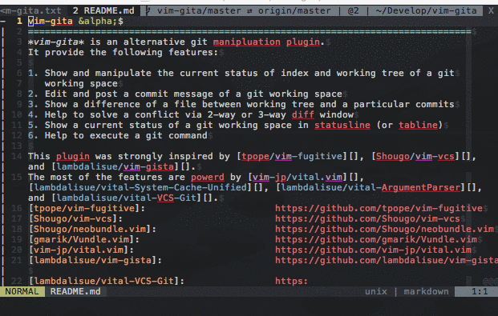
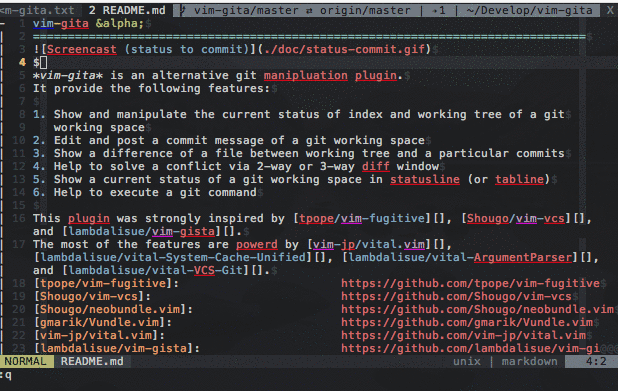

vim-gita &alpha; version
===============================================================================


*vim-gita* is an alternative git manipluation plugin.
It provide the following features:

1. Show and manipulate the current status of index and working tree of a git
   working space
2. Edit and post a commit message of a git working space
3. Show a difference of a file between working tree and a particular commits
4. Help to solve a conflict via 2-way or 3-way diff window
5. Show a current status of a git working space in statusline (or tabline)
6. Help to execute a git command

This plugin was strongly inspired by [tpope/vim-fugitive][], [Shougo/vim-vcs][], and [lambdalisue/vim-gista][].
The most of the features are powerd by [vim-jp/vital.vim][], [lambdalisue/vital-System-Cache-Unified][], [lambdalisue/vital-ArgumentParser][], and [lambdalisue/vital-VCS-Git][].
[tpope/vim-fugitive]:                       https://github.com/tpope/vim-fugitive
[Shougo/vim-vcs]:                           https://github.com/Shougo/vim-vcs
[Shougo/neobundle.vim]:                     https://github.com/Shougo/neobundle.vim
[gmarik/Vundle.vim]:                        https://github.com/gmarik/Vundle.vim
[vim-jp/vital.vim]:                         https://github.com/vim-jp/vital.vim
[lambdalisue/vim-gista]:                    https://github.com/lambdalisue/vim-gista
[lambdalisue/vital-VCS-Git]:                https://github.com/lambdalisue/vital-VCS-Git
[lambdalisue/vital-ArgumentParser]:         https://github.com/lambdalisue/vital-ArgumentParser
[lambdalisue/vital-System-Cache-Unified]:   https://github.com/lambdalisue/vital-System-Cache-Unified

Install
-------------------------------------------------------------------------------
The repository follow a standard directory structure thus you can use [gmarik/Vundle.vim], [Shougo/neobundle.vim], or other vim plugin manager to install vim-gita like:

```vim
" Vundle.vim
Plugin 'lambdalisue/vim-gita'

" neobundle.vim
NeoBundle 'lambdalisue/vim-gita'

" neobundle.vim (Lazy)
NeoBundleLazy 'lambdalisue/vim-gita', {
        \ 'autoload': {
        \   'commands': ['Gita'],
        \}}
```

If you are not using any vim plugin manager, you can copy the repository to your $VIM directory to enable the plugin.

Usage
-------------------------------------------------------------------------------

Basically you will follow the following steps to commit your changes

1. Add/Delete/Modify several files
2. Open a status window
3. Stage/Unstage several files which required to be committed
4. Open a commit window
5. Open a file in diff mode to write your commit message
5. Close the window (or hit `CC`) to commit

And following steps to solve conflicts in merge/rebase

1. Execute a git command via `:Gita` command
2. Open a status window
3. Open a 2-way or 3-way diff for conflicted files
4. Press `-a` to mark conflicted files as solved
5. Open a commit window and commit the changes

See the details of each interface below.

### Status

To display a current status of a git working tree, execute the following command on a file buffer

    :Gita status

It will open a status window which indicate the current status of the git working tree (of the current buffer belongs).
If the current buffer is not under a git working tree, it won't open the window.

The status window exists mainly for stage/unstage changes, hit `?m` to see the default mappings for manipulating statuses.

In the status window, you will see the current status of the git working tree in 'Short Format' (`git status --short`). Hit `?s` to see a help of 'Short Format'.

The following mappings are available in the window

| Key          | Description                                                           |
|--------------|-----------------------------------------------------------------------|
| `q`          | Close the window                                                      |
| `?m`         | Toggle a help for mapping                                             |
| `?s`         | Toggle a help abount 'Short Format'                                   |
| `<C-l>`      | Update the status                                                     |
| `cc`         | Switch to a commit window                                             |
| `cC`         | Switch to a new commit window                                         |
| `cA`         | Switch to a new amend commit window                                   |
| `e`          | Open a file via `edit`                                                |
| `E`          | Open a file via `vsplit`                                              |
| `d`          | Open a diff file via `edit`                                           |
| `D`          | Open a file in diff mode via `vsplit`                                 |
| `s`          | Open a conflicted file in 2-way diff mode to solve conflicts          |
| `S`          | Open a conflicted file in 3-way diff mode to solve conflicts          |
| `<<`         | Stage changes of a file                                               |
| `>>`         | Unstage changes of a file                                             |
| `--`         | Toggle stage/unstage changes of a file                                |
| `==`         | Discard changes of a file on worktree (the operation is irreversible) |
| `-a` or `-A` | Add a file to index                                                   |
| `-d` or `-D` | Delete a file from index                                              |
| `-r`         | Reset a file of index                                                 |
| `-c` or `-C` | Checkout a file from a specified commit                               |


### Commit

To prepare a commit, execute the following command to open a commit window to edit a commit message (or hit `cc`, `cC`, or `cA` in a status window).

    :Gita commit

It will open a commit window which indicate the current status of next commit.
If the current buffer is not under a git working tree, it won't open the window.

The commit window exsits mainly for editing a commit message, thus most of status manipulation keys are not available in the window.
To manipulate the status again, hit `cc` to return the status window.
Hit `?m` to see a helo of default mappings available in the commit window.

In the commit window, you also see the current status of the git working tree in 'Short Format' (`git status --short`). Hit `?s` to see a help of 'Short Format'.

An actual commit will performed when user hit `CC` or the commit window is closed.

The following mappings are available in the window

| Key          | Description                                                           |
|--------------|-----------------------------------------------------------------------|
| `q`          | Close the window                                                      |
| `?m`         | Toggle a help for mapping                                             |
| `?s`         | Toggle a help abount 'Short Format'                                   |
| `<C-l>`      | Update the status                                                     |
| `cc`         | Switch to a status window                                             |
| `CC`         | Perform an actual commit command                                      |
| `e`          | Open a file via `edit`                                                |
| `E`          | Open a file via `vsplit`                                              |
| `d`          | Open a diff file via `edit`                                           |
| `D`          | Open a file in diff mode via `vsplit`                                 |


### Diff



To visualize the difference of the current buffer between working tree and index, branch, or commit, execute the following command or hit `d` or `D` in a status/commit window:

    :Gita diff

It will prompt a input window to ask which commit you want to compare with.

### Conflict

To solve a conflicted file, move the cursor on a conflicted file and hit `s` or `S` in a status/commit window.
It will open a 2-way or 3-way diff to solve a conflicted file (a conflicted file of both added, added by us, added by them, or both modified).

In a 2-way diff, the left or top window is a LOCAL version and right or bottom window is a REMOTE version.
Any modification on a REMOTE version is prohibited and if you call `:w` on the LOCAL version, the changes will be written into the
local file.

In a 3-way diff, the left or top window is a LOCAL version, the middle window is a MERGE version, and the right or bottom window is a REMOTE version.
Any modification on a LOCAL or REMOTE version is prohibited.
You can get a changes of LOCAL version with hitting `dol` (diff obtain from local) and of REMOTE version with hitting `dor` (diff obtain from remote) in the MERGE window.
If you hit `dp` on the LOCAL or REMOTE window, the changes will be put on the MERGE window.
If you call `:w` on the MERGE version, the changes will be written into the local file.

After you solve all conflicts, open a status window and mark the file as solved by hitting `-a`.


### Statusline

vim-gita provide several components to show a current status on vim's statusline (or tabline).
All status used in the components are well cached thus you don't have to worry about the performance (the caches will be cleared when a particular `vim-gita-{commnad}-post` autocmd is called).
Use `gita#statusline#preset()` to get a preset or `gita#statusline#format()` to create your own component.

```vim
" Example usage of gita#statusline#preset()
echo gita#statusline#preset('branch')
" vim-gita/master <> origin/master
echo gita#statusline#preset('status')
" !5 +2 "4 *4
echo gita#statusline#preset('traffic')
" <5 >4

" Example usage of gita#statusline#format()
echo gita#statusline#format('%ln/%lb # %rn/%rb')
" vim-gita/master # origin/master
```

The following is my tabline setting via [itchyny/lightline.vim](https://github.com/itchyny/lightline.vim)

```vim
let g:lightline = {
      \ 'colorscheme': 'hybrid',
      \ 'active': {
      \   'left': [
      \     [ 'mode', 'paste' ],
      \     [ 'filename' ],
      \   ],
      \   'right': [
      \     [ 'lineinfo' ],
      \     [ 'fileformat', 'fileencoding', 'filetype' ],
      \   ],
      \ },
      \ 'inactive': {
      \   'left': [
      \     [ 'filename' ],
      \   ],
      \   'right': [
      \     [ 'fileformat', 'fileencoding', 'filetype' ],
      \   ],
      \ },
      \ 'tabline': {
      \   'left': [
      \     [ 'tabs' ],
      \   ],
      \   'right': [
      \     [ 'close' ],
      \     [ 'git_branch', 'git_traffic', 'git_status', 'cwd' ],
      \   ],
      \ },
      \ 'component_visible_condition': {
      \   'lineinfo': '(winwidth(0) >= 70)',
      \ },
      \ 'component_function': {
      \   'git_branch': 'g:lightline.my.git_branch',
      \   'git_traffic': 'g:lightline.my.git_traffic',
      \   'git_status': 'g:lightline.my.git_status',
      \ },
      \}
let g:lightline.my = {}
function! g:lightline.my.git_branch() " {{{
  return winwidth(0) > 70 ? gita#statusline#preset('branch') : ''
endfunction " }}}
function! g:lightline.my.git_traffic() " {{{
  return winwidth(0) > 70 ? gita#statusline#preset('traffic') : ''
endfunction " }}}
function! g:lightline.my.git_status() " {{{
  return winwidth(0) > 70 ? gita#statusline#preset('status') : ''
endfunction " }}}
```


### Commands

All Git commands can be executed via Gita command like

    :Gita push

It will execute a push command and display the result. With this way, vim-gita's autocmd will be executed and cached values will be automatically cleared.

If you want to execute status, commit, or diff command in a way which other commands do.
Add `!` to tell a Gita to NOT use specialized interface. 
The following example will call a status command in a way which other commands do and no status window will be appeared.

    :Gita! status


Documents
-------------------------------------------------------------------------------

See more documents on [vim-gita.txt](./doc/vim-gita.txt) or execute `:help vim-gita`


ToDo
-------------------------------------------------------------------------------

- [x] Add base structure of the plugin
- [x] Add status manipulation window
- [x] Add commit message editing window
- [x] Add actual commit execution on the window
- [x] Add 2-way diff window
- [x] Add 2-way diff (LOCAL, REMOTE) to help solving conflict
- [x] Add 3-way diff (LOCAL, MERGE, REMOTE) to help solving conflict
- [x] Add a way to display a current git status in statusline/tabline
- [x] Allow to execute a git raw command with :Gita
- [ ] Add options to status/commit/diff command
- [ ] Add conflict command like status/commit/diff command
- [ ] Add git blame interface
- [ ] Browse a selected file region on GitHub/GitHub enterprise
- [ ] Allow to execute commands in async mode via vimproc

License
-------------------------------------------------------------------------------
The MIT License (MIT)

Copyright (c) 2015 Alisue, hashnote.net

Permission is hereby granted, free of charge, to any person obtaining a copy
of this software and associated documentation files (the "Software"), to deal
in the Software without restriction, including without limitation the rights
to use, copy, modify, merge, publish, distribute, sublicense, and/or sell
copies of the Software, and to permit persons to whom the Software is
furnished to do so, subject to the following conditions:

The above copyright notice and this permission notice shall be included in
all copies or substantial portions of the Software.

THE SOFTWARE IS PROVIDED "AS IS", WITHOUT WARRANTY OF ANY KIND, EXPRESS OR
IMPLIED, INCLUDING BUT NOT LIMITED TO THE WARRANTIES OF MERCHANTABILITY,
FITNESS FOR A PARTICULAR PURPOSE AND NONINFRINGEMENT. IN NO EVENT SHALL THE
AUTHORS OR COPYRIGHT HOLDERS BE LIABLE FOR ANY CLAIM, DAMAGES OR OTHER
LIABILITY, WHETHER IN AN ACTION OF CONTRACT, TORT OR OTHERWISE, ARISING FROM,
OUT OF OR IN CONNECTION WITH THE SOFTWARE OR THE USE OR OTHER DEALINGS IN
THE SOFTWARE.
